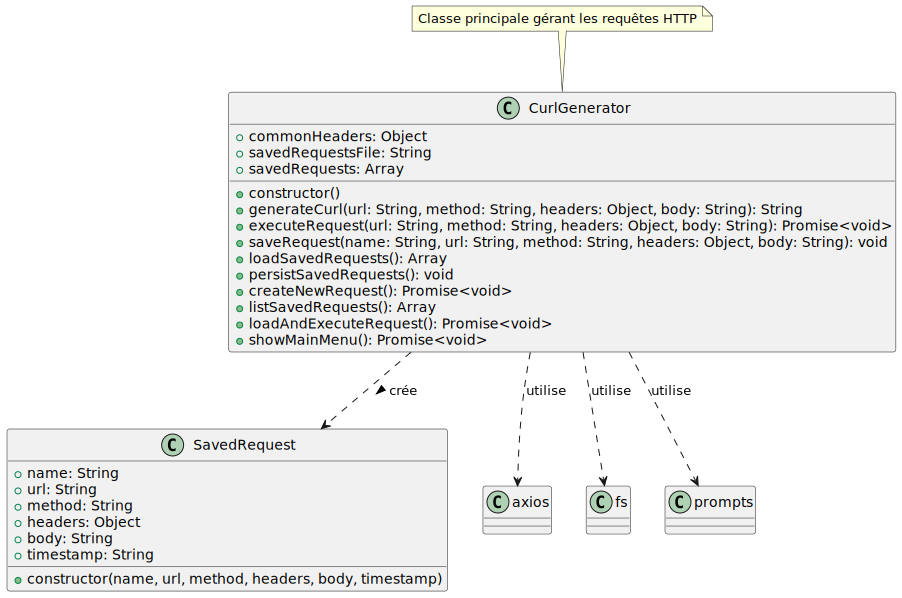

# Curl Edu

Un outil pédagogique pour l'apprentissage et la compréhension de curl et des requêtes HTTP. Ce projet sert de support de cours pour enseigner :
* Les fondamentaux des requêtes HTTP
* L'utilisation de curl en ligne de commande
* Les méthodes HTTP (GET, POST, PUT, DELETE, etc.)
* L'analyse des réponses HTTP

## 🎓 Contexte éducatif

Ce toolkit est conçu comme matériel pédagogique pour les cours de réseaux et développement web. Il permet aux étudiants de :
* Comprendre comment fonctionnent les requêtes HTTP dans un environnement contrôlé
* Apprendre à utiliser curl efficacement
* Pratiquer différents types de requêtes HTTP
* Analyser les en-têtes et les réponses HTTP

## 📊 Diagramme de classes



## 📋 Prérequis

- Node.js (version 14.x ou supérieure)
- npm (généralement installé avec Node.js)

## 📁 Structure du projet

```
curlEdu/
├── app.js           # Script principal d'apprentissage
├── package.json     # Configuration du projet Node.js
└── README.md        # Documentation
```

## 🔧 Installation

```bash
# Cloner le dépôt
git clone https://github.com/bouhenic/curlEdu.git
cd curlEdu

# Installation des dépendances Node.js
npm install
```

## 🚀 Utilisation dans un cadre pédagogique

```bash
node app.js
```

## 📦 Dépendances principales

- axios : Pour effectuer les requêtes HTTP
- prompts : Pour l'interface utilisateur interactive

## 💾 Sauvegarde des requêtes

Les requêtes peuvent être sauvegardées dans un fichier JSON local pour référence ultérieure.